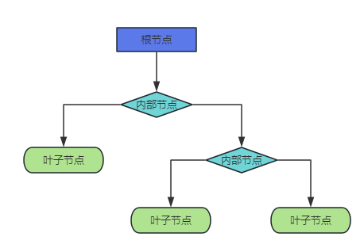
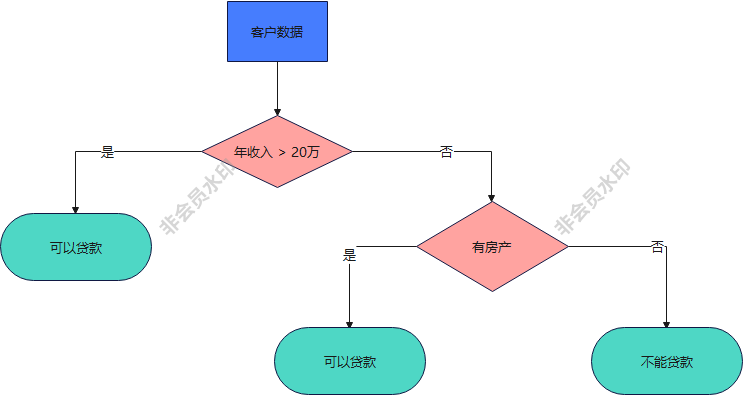
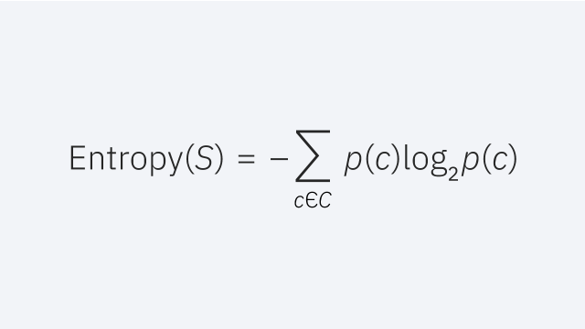
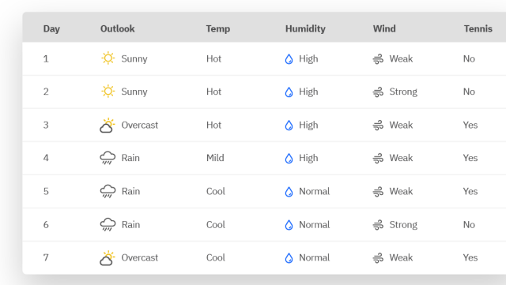
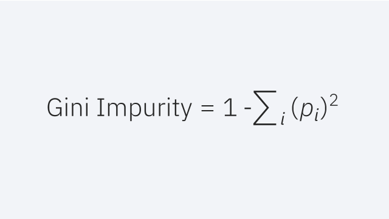

@[TOC](以下是我们将涉及内容的概览:)

## 决策树

决策树是一种用于分类和回归任务的非参数监督学习算法。 它是一种分层树形结构，使用层层推理来实现最终的分类。决策树由下面几种元素构成：

- 根节点：包含样本的全集
- 内部节点：对应特征属性测试
- 叶节点：代表决策的结果

预测时，在树的内部节点处用某一属性值进行判断，根据判断结果决定进入哪个分支节点，直到到达叶节点处，得到分类结果。

这是一种基于 if-then-else 规则的有监督学习算法，决策树的这些规则通过训练得到，而不是人工制定的。

决策树是最简单的机器学习算法，它易于实现，可解释性强，完全符合人类的直观思维，有着广泛的应用。

举个例子。银行要用机器学习算法来确定是否给客户发放贷款，为此需要考察客户的年收入，是否有房产这两个指标。首先判断客户的年收入指标。如果大于20万，可以贷款；否则继续判断。然后判断客户是否有房产。如果有房产，可以贷款；否则不能贷款。
这个例子的决策树如下图所示：

## 决策树的学习（创建决策树）

决策树学习采用"一一击破"的策略，执行贪心搜索 (greedy search) 来识别决策树内的最佳分割点。 然后以自上而下的回归方式重复此拆分过程，直到所有或者大多数记录都标记为特定的类别标签。 是否将所有数据点归为同类子集在很大程度上取决于决策树的复杂性。 较小的决策树更容易获得无法分裂的叶节点，即单个类别中的数据点。 然而，决策树的体量越来越大，就会越来越难保持这种纯度，并且通常会导致落在给定子树内的数据过少。 这种情况被称为数据碎片，通常会引起数据过拟合。 因此通常选择小型决策树，这与奥卡姆剃刀原理的"简单有效原理"相符，即"如无必要，勿增实体"。 换句话说，我们应该只在必要时增加决策树的复杂性，因为最简单的往往是最好的。 为了降低复杂性并防止过拟合，通常采用剪枝算法；这一过程会删除不太重要的特征的分支。 然后，通过交叉验证评估模型的拟合。 另一种保持决策树准确性的方法是使用随机森林算法形成一个集合；这种分类法可以得到更加准确的预测结果，特别是在决策树分支彼此不相关的情况下。

## 决策树的类型

Hunt 算法于 20 世纪 60 年代提出，起初用于模拟心理学中的人类学习，为许多常用的决策树算法奠定了基础，例如：

- **ID3**： 该算法的开发归功于 Ross Quinlan，全称为"迭代二叉树 3 代" ("Iterative Dichotomiser 3")。 该算法利用信息熵与信息增益作为评估候选拆分的指标。  来自Quinlan 自 1986 年对这种算法的研究。

- **C4.5**：该算法是 ID3 的后期扩展，同样由 Quinlan 开发。 它可以使用信息增益或增益率来评估决策树中的切分点。

- **CART**：术语 "CART" 的全称是"分类和回归"，提出者是 Leo Breiman。 该算法通常利用"基尼不纯度"来确定要拆分的理想属性。 基尼不纯度衡量随机选择的属性被错误分类的频率。 使用该评估方法时，基尼不纯度越小越理想。

## 如何在每个节点上选择最佳属性

虽然可以使用许多方法在每个节点上选择最佳属性，但信息增益和基尼不纯度这两种方法是最常用的决策树模型拆分标准。 它们有助于评估每个测试条件的质量以及样本分类能力。

### 信息熵和信息增益

如果不讨论信息熵，就很难解释信息增益。 信息熵是一个源于信息论的概念，用于衡量样本值的不纯度。 它由以下公式定义，其中：

- S 代表计算信息熵的数据集
- c 表示集合中的类
- p(c) 表示属于类别 c 的数据点占数据集中总数据点数的比例

熵值介于 0 和 1 之间。 如果数据集 S 中的所有样本都属于一类，则熵值为零。 如果一半样本属于一类，而另一半属于另一类，则熵值为最高值 1。 为了选择要拆分的最佳特征并确定最佳决策树，必须使用熵值最小的属性。 信息增益表示拆分给定属性之前和之后的熵值差异。 具有最大信息增益的属性的拆分效果最佳，因为它在根据训练数据的目标类别进行分类的效果最佳。 信息增益通常用以下公式表示：

- a 表示特定的属性或类标签
- 信息熵 (S) 是数据集的熵，S
- |Sv|/ |S| 表示 Sv 值与数据集的值的比例，S
- 信息熵 (Sv) 是数据集的熵值，Sv

让我们通过一个示例来巩固对这些概念的理解。 假设我们有以下任意数据集：

在这个数据集中，信息熵为 0.94。 通过确定"打网球"为"是"的天数比例 (9/14) 和"打网球"为"否"的天数比例 (5/14) 来计算。 然后将这些值代入上面的信息熵公式。

熵（网球）= -(9/14) log2(9/14) – (5/14) log2 (5/14) = 0.94

然后我们可以单独计算每个属性的信息增益。 例如，属性"湿度"的信息增益如下：

增益（网球，湿度）= (0.94)-(7/14)*(0.985) – (7/14)*(0.592) = 0.151

回顾一下，

- 7/14 表示湿度为"高"的值与湿度值总数的比例。 在这种情况下，湿度为"高"的值的数量与湿度为"正常"的值的数量相同。

- 0.985 是"湿度=高"的熵值

- 0.59 是"湿度=正常"的熵值

然后重复计算上表中每个属性的信息增益，并选择信息增益最高的属性作为决策树中的第一个切分点。 在这种情况下，outlook 会产生信息增益最大值。 同时对每个子树重复该过程。

### 基尼不纯度

基尼不纯度指根据数据集的类别分布来标记其随机数据点时，出现错误分类的概率。 与信息熵类似，如果数据集 S 无法继续拆分（即属于一个类别），那么其不纯度为零。 公式如下：

## 决策树的优缺点

虽然决策树可用于多种用例，但其他算法通常优于决策树算法。 也就是说，决策树对于 数据挖掘 与知识发现任务特别有效。 下面让我们探讨利用决策树的主要优势与挑战：

### 决策树优势

- 易于解释： 决策树的布尔逻辑和可视化表现形式有助于理解和使用。 决策树的分层结构也更易于发现最重要的属性，而其他算法并不能清楚表明，比 神经网络。

- 几乎不需要数据准备： 决策树具有许多特征，比其他分类方法更加灵活。 它可以处理离散型或连续型等各种数据类型，并且连续值可通过使用阈值转换为分类值。 此外，它还可以处理具有缺失值的数据，这种数据会给其他分类方法（如朴素贝叶斯算法）造成困难。

- 更加灵活：决策树可用于分类和回归任务，比其他一些算法更灵活。 它对属性之间的潜在关系也不敏感；这意味着，如果两个变量的相关性极高，那么该算法只会选择其中一个特征来拆分。

### 决策树缺点

- 容易过拟合：复杂的决策树往往会出现过拟合，并且不能很好地用于新数据。 这种情况可以通过预剪枝或后剪枝来避免。 预剪枝在数据不足时停止决策树的发展，而后剪枝在决策树形成后删除数据不足的子树。

- 预估器方差高： 数据中的微小变化会产生非常不同的决策树。 Bagging算法或估计值的平均值可以降低决策树方差。 然而，这种方法使用起来有限，会产生高度相关的预测器。

- 成本更高：决策树在构建过程中采用贪心搜索方法，其训练成本会高于其他算法。

- 在 scikit-learn 中无法得到完全支持：   Scikit-learn 是一个常用的基于 Python 的机器学习库。 虽然 scikit-learn 库有决策树模块（DecisionTreeClassifier)，但当前的实现不支持分类变量。

## 总结

这是文章的最后一部分了——非常感谢你能阅读到最后。

希望这篇指南对你有所帮助，能让你了解什么是决策树。

如果你对AI+数据分析感兴趣，可以试试[易从](https://www.openai36.com)这个网站。这个网站，无需懂数学，无需会Python，用聊天的方式就能完成数据分析。把excel（或csv）上传给大模型，大模型根据聊天指令自动完成数据分析。

感谢你阅读本文！
