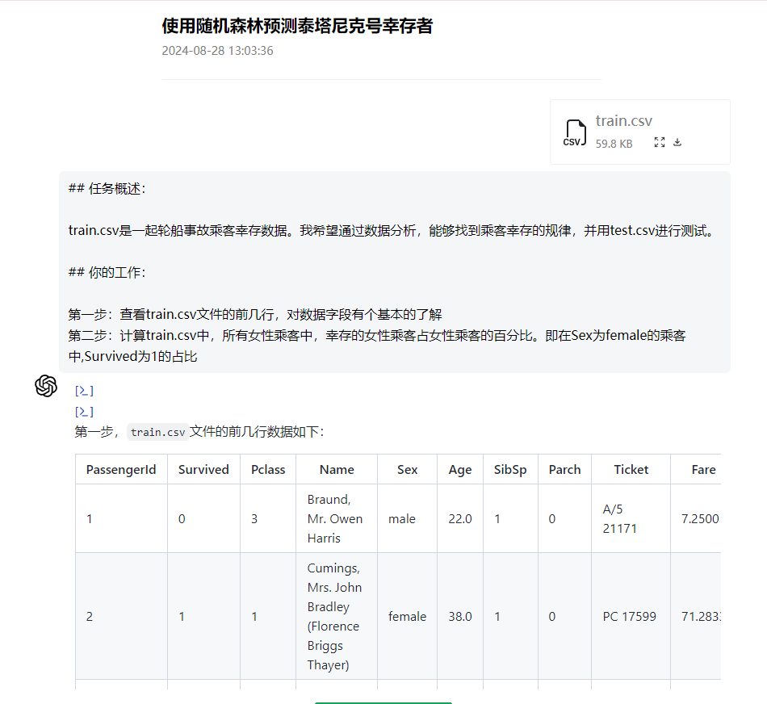
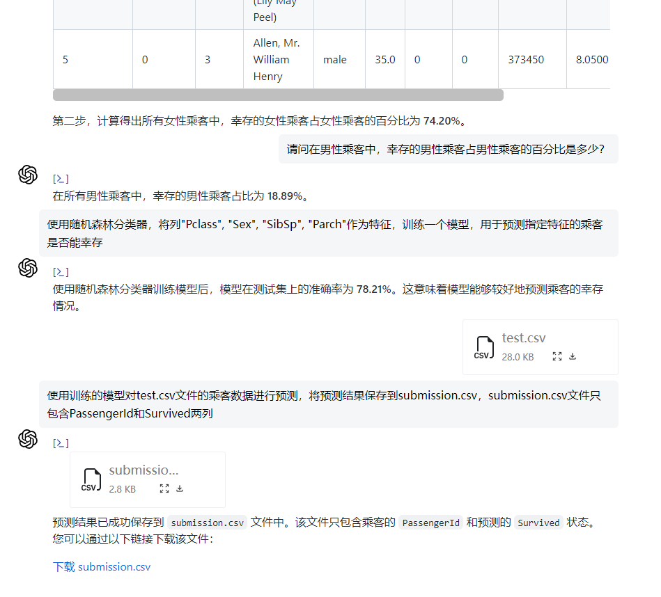

# 【AI+数据分析】之让AI用随机森林完成泰坦尼克号生存预测

## 概述

泰坦尼克号的沉没是历史上最臭名昭著的沉船事件之一。1912 年 4 月 15 日，在她的首次航行中，被广泛认为“永不沉没”的泰坦尼克号在与冰山相撞后沉没。不幸的是，没有足够的救生艇供船上每个人使用，导致 2224 名乘客和船员中有 1502 人死亡。

虽然幸存中涉及到一些运气成分，但似乎有些人比其他人更有可能幸存。

在本次分析中，我们将使用乘客数据（即姓名、年龄、性别、社会经济阶层等），建立一个预测模型来回答以下问题：“什么样的人更有可能幸存？”

## 数据

有两个相似的数据集，一个是训练集train.csv，另一个是测试集test.csv。

train.csv包含乘客子集的详细信息（准确地说是 891 人），揭示了他们是否幸存，也称为“基本事实”。test.csv 数据集包含类似的信息，但没有透露每位乘客是否幸存，预测这些结果是你的工作，即：使用你在 train.csv 数据中找到的模式，预测船上的其他 418 名乘客（在 test.csv中找到）是否幸存。

## 实施流程

1. 了解、分析问题；
1. 获取训练集和测试集；
1. 进行数据整理和清洗；
1. 分析识别模式并探索数据，进行特征处理；
1. 建模、预测和解决问题；
1. 提交结果。

【注】我们要解决的问题是：从训练集中训练出来的模型是否可以根据给定的不包含幸存信息的测试集，确定测试集中的这些乘客是否幸存。有几个需要注意的重点：

- 1912 年 4 月 15 日，泰坦尼克号在与冰山相撞后沉没，2224 名乘客和船员中有 1502 人遇难，即32%的存活率；
- 沉船事故导致生命损失的原因之一是没有足够的救生艇供乘客和船员使用；
- 尽管在沉没中幸存下来有一些运气成分，但某些人群比其他人群更有可能幸存下来，例如妇女、儿童和上层阶级。

## 详细的分析过程

  [使用随机森林预测泰塔尼克号幸存者](https://www.openai36.com/share/f4b5d7d1-6c38-4898-b1b6-71d8fd8e57f8)

  分析截图

  

  

## 参考文档

  [Titanic - Machine Learning from Disaster](https://www.kaggle.com/competitions/titanic)