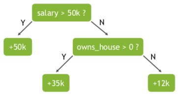
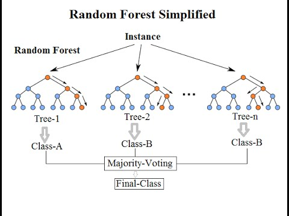

# 随机森林

随机森林是一种监督式算法，使用由众多决策树组成的一种集成学习方法，输出是对问题最佳答案的共识。随机森林可用于分类或回归。

## 什么是随机森林？

随机森林是用于分类和回归的一种主流集成学习方法。

集成学习方法结合了多种机器学习 (ML) 算法，以获得更好的模型 – 应用于数据科学的群体智慧。此类学习方法基于这样一种概念：一群对问题领域知之有限的人集思广益，可以获得比一个知识丰富的人更好的解决方案。

随机森林是一组决策树，是几乎人人都熟悉的解决问题的比喻。决策树通过针对数据集元素，询问一系列回答是否的问题来得出答案。在下面的示例中，为了预测一个人的收入，决策会考虑变量（特征），例如此人是否有工作（是或否）以及此人是否有房子。在算法环境中，机器会不断搜索特征，以允许将一组中的观察结果按如下方式进行分割，即结果组之间尽可能不同，而每个不同子组的成员之间尽可能相似。

随机森林使用名为“bagging”的技术，通过数据集和特征的随机自助抽样样本并行构建完整的决策树。虽然决策树基于一组固定的特征，而且经常过拟合，但随机性对森林的成功至关重要。

随机性可确保单个树之间的相关性较低，从而减少偏差风险。大量树的存在也减少了过拟合问题，如果模型在训练数据中加入过多“噪声”并因此做出糟糕决策，这种问题就会出现。

使用随机森林模型，随着模型中不相关树的数量增加，做出正确预测的可能性也会增加。结果的质量更高，因为它们反映了大多数树做出的决策。此投票过程通过限制误差来保护每个树不互相伤害。即使有些树错误，也会有一些树正确，因此这组树集体朝正确的方向前行。虽然随机森林模型在考虑许多特征时可能会运行缓慢，但即使是使用有限数量特征的小模型也会产生非常好的结果。

## 随机森林的工作原理是什么？

随机森林中的每棵树在称为自助聚集 (bagging) 的过程中随机对训练数据子集进行抽样。该模型适合这些较小的数据集，并汇总预测结果。通过有放回抽样，可以重复使用同一数据的几个实例，结果就是，这些树不仅基于不同的数据集进行训练，而且还使用不同的特性做出决策。

### 用例

分类示例包括：

- 欺诈检测
- 垃圾邮件检测
- 文本情感分析
- 预测患者风险、败血症或癌症

回归示例包括：

- 预测欺诈数量
- 预测销售额

## 为何选择随机森林？

随机森林模型有五个主要优点：

- 非常适合回归和分类问题。回归中的输出变量是一个数字序列，例如某个街区的房价。分类问题的输出变量通常是一个单一答案，例如房屋的售价是否高于或低于要价。
- 可以处理缺失值并保持高准确性，即使由于 bagging 和有放回抽样而缺失大量数据时也是如此。
- 算法由于输出的是“多数规则”，使得模型几乎不可能过拟合。
- 该模型可以处理包含数千个输入变量的庞大数据集，因此成为降维的不错工具。
- 其算法可用于从训练数据集中识别非常重要的特征。

其也有一些缺点：

- 随机森林优于决策树，但其准确性低于 XGBoost 等梯度提升树集成。
- 随机森林包含大量树，因此速度比 XGBoost 慢。

## 梯度提升决策树

梯度提升决策树 (GBDT) 是一种决策树集成学习算法，类似于用于分类和回归的随机森林。随机森林和 GBDT 都构建了由多个决策树组成的模型。两者的区别在于重建和组合的方式。

GBDT 使用一种称为 boosting 的技术，以迭代方式训练一组浅层决策树，每次迭代都使用上一个模型的残差拟合下一个模型。最终得到的预测结果是所有树预测结果的加权总和。随机森林 bagging 可大幅减少差异和过拟合，而 GBDT boosting 则可减少偏差和欠拟合。

XGBoost（极端梯度提升）是 GBDT 的领先、可扩展的分布式变体。使用 XGBoost 时，树并行构建，而非顺序构建。GBoost 遵循按层生长策略，扫描梯度值并使用这些部分和来评估训练集中每个可分割点的分割质量。

XGBoost 因其广泛的用例、可移植性、多样化的语言支持以及云集成而广受欢迎。

与 XGBoost 相比，随机森林模型的准确性可能会因两个不同的误差来源（偏差和方差）而下降：

- 梯度提升模型通过以低学习率进行多轮提升来消除偏差和方差。
- 梯度提升模型超参数也有助于消除方差。
- 随机森林模型使用树深度和树的数量消除偏差和方差。
- 随机森林树可能需要比梯度提升树更深入。
- 更多数据可减少偏差和方差。

## 总结

这是文章的最后一部分了——非常感谢你能阅读到最后。

希望这篇指南对你有所帮助，能让你了解什么是随机森林。

如果你对AI+数据分析感兴趣，可以试试[易从](https://www.openai36.com)这个网站。这个网站，无需懂数学，无需会Python，用聊天的方式就能完成数据分析。把excel（或csv）上传给大模型，大模型根据聊天指令自动完成数据分析。

我在[易从](https://www.openai36.com)上，用AI做了一个[使用随机森林预测泰塔尼克号幸存者](https://www.openai36.com/share/f4b5d7d1-6c38-4898-b1b6-71d8fd8e57f8)，可作为辅助参考。

感谢你阅读本文！